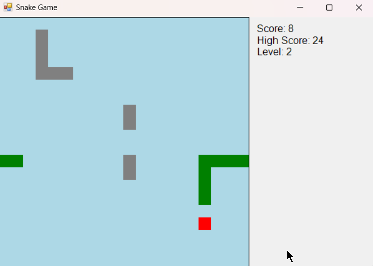

# Snake Game 🐍

A classic Snake game implemented in **C# Windows Forms**. This project was developed as part of the **Digital Egypt Pioneers Initiative (DEPI)** program. It includes modern features like obstacles, score tracking, high score saving, and incremental levels.

---

## Features ✨
- **Classic Snake Gameplay**: Move the snake around the board to eat food and grow longer.
- **Obstacles**: Walls and barriers make the game more challenging.
- **Score Tracking**: Keep track of your score as you play.
- **High Score Saving**: Save your high score to a file and compete with yourself.
- **Incremental Levels**: The game gets faster and harder as you progress.
- **Sound Effects**: Enjoy sound effects for eating food and game over.
- **Responsive Controls**: Use arrow keys to control the snake.

---

## Screenshots 🖼️

  

---

## Installation and Setup 🛠️

### Prerequisites
- [.NET Framework](https://dotnet.microsoft.com/download/dotnet-framework) (version 4.7.2 or higher)
- [Visual Studio](https://visualstudio.microsoft.com/) (recommended for development)

### Steps to Run
1. Clone the repository:
   ```bash
   git clone https://github.com/your-username/snake-game.git

2. Open `SnakeGame\bin\Debug\SnakeGame.exe`
